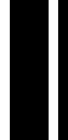
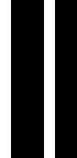
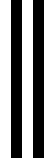
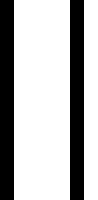

# A3: Caching + Barcode Generator

In this assignment, we will create an “barcode” program where they read in user-supplied arguments, use malloc to create an image struct/pixel array, and manipulate the pixel array to generate a barcode!

Then, we will inspect how image operations can impact the cache! We will measure various "filtering" operations with `cachegrind`.


# Image Calculator

In this problem set, we will be building a "barcode" functionality for an image calculator in C.

Our C image calculator will allow us to take in as input, a path to an barcode digit string, width, height, and an output path. 

Then, our C image calculator, will perform the barcode operation on the input barcode digit string and save the new image at the output path.

## Step 0: What is an image and provided loader.c 

### Included Files
For this project we supply you with:
- `common.h` which specifies the structure of an image in our calculator program
- `loader.h` and `loader.c`: These make up an image library, which loads/saves images in the `.bmp` format. 
- `filter.c` which we will use in Step 4/5. We will analyze how well the supplied filter operations perform and inspect their cache behavior.
- `barcode.h` specifying the function headers for the generate_barcode function (you will be implementing this!)
- `images/` is a directory of bmp format images which you can use as input.
    - `16x16.bmp` - `4096X4096.bmp` will be used in step 5 to analyze the performance of image operations on various sized images.
- `reference/` is a directory containing reference images for each operation. 
    - Check these out on github in order to see a good example of what your output should look like!

#### Your task for this assignment:
- You will also need to complete `image_calc.c` which is the driver for our barcode generation program.
- You will need to create `barcode.c`, which will implement the functionality of the image operations.
- You will also need to use `eval.sh` and `plot.py` in order to gather and plot the performance data of the image operations (see step 4 for more details).

### Image Representation

What is a barcode? A barcode is an image. But what is an image in C?

An image in our program is a 2d array of pixels. Each pixel has a red channel (ranging from 0-255), a green channel (ranging from 0-255), and a blue channel (ranging from 0-255).

The 2d array is flattened and represented in row-major order. This is a common convention for how to represent 2d arrays in one contiguous block in memory.

See: (https://diveintosystems.org/book/C2-C_depth/arrays.html#_method_1_memory_efficient_allocation) for an example of how we are efficiently allocating and accessing our 2d array.

An image has a width, height, and an array of pixels.


You will be manipulating these pictures in this assignment.

#### View the images!
- On GitHub (maybe you are viewing the readme from github already), click the following link: [/reference/barcode-1.bmp](/reference/barcode-1.bmp)
    - Click 'view raw'. You should see an image of a sky.
    - Note: If you want to see an image, you will need to view it outside of the environment. We recommend you do so by performing any manipulations and then pushing the results to this repo. You can then view the results on the github web interface.

To find the dimension of an image, use the following command:

```file reference/barcode-1.bmp```

- You should see the dimension: `113 x 42 x 24`. This means the image width is 113, the height is 42, and there are 24 bits used to represent each pixel (you can ignore this!).


## Step 1: Allocate Space for an Image


    - **Note**: The Dive Into Systems reading on command-line arguments may be helpful, especially how to process integer inputs. (https://diveintosystems.org/book/C2-C_depth/advanced_cmd_line_args.html#_c_cmd_line_args_)
    - The command line arguments will be in the following format:
        - ```./build/image_calc <barcode_value> <width> <height> <output_path>```

- In `barcode.c` add code to `malloc` the space needed for an image struct **and its pixels**. You will need to initialize some of the members of the image struct.
    - To start, have `barcode.c` return a pointer to this blank image back to `image_calc.c`.
    - Double-check that your `image_calc.c` correctly populates the variable `output_filepath` with the output file path from argv (so that `saveimage` will be called correctly).
- Once you're all set you should be able to run `make` without any errors.
- Try running: ```./build/image_calc 071537020427 113 42 barcode.bmp```
    - This should produce a blank image at barcode.bmp.


## Step 2: Barcode 

Now we wish to add a barcode-generation functionality to our image calculator. 

### What is a barcode?

A barcode is just an encoding of 12 numerical digits into vertical stripes of black and white. 

In our encoding, we will assume each vertical bar is exactly one pixel wide for simplicity.


- Each digit is represented by 7 vertical bars of either black or white. 
    -  If the digit is the right half of the barcode, use the R encoding of the digit. If the digit is in the left half of the barcode, use the L encoding of the digit.
- The start pattern of the barcode is a special pattern of 3 bars.
- The end pattern of the barcode is a special pattern of 3 bars.
- The middle pattern, between the 6 left digits and 6 right digits, is 5 bars.
- We also include a quiet zone of white 9 bars on either side.

This means in total, a barcode should be:
` 7*12 (digits) + 9*2 (quite zone) + 3 (start) + 3(end) + 5(middle) = 113 pixels wide`

In total a barcode can be understood as follows:


The digit encoding we will use is below:

<table style="text-align:center; background-color:#80A080">
<caption>Encoding table for UPC-A barcode pattern S<u>L</u>LLLLLMRRRRR<u>R</u>E</caption>
<tbody>
<tr>
  <th rowspan="2">Quiet<br>zone</th>
  <th rowspan="2">S<br>(start)</th>
  <th colspan="10">L<br>(left numerical digit)</th>
  <th rowspan="2">M<br>(middle)</th>
  <th colspan="10">R<br>(right numerical digit)</th>
  <th rowspan="2">E<br>(end)</th>
  <th rowspan="2">Quiet<br>zone</th>
</tr>

<tr>
  <th>0</th>
  <th>1</th>
  <th>2</th>

  <th>3</th>
  <th>4</th>
  <th>5</th>
  <th>6</th>

  <th>7</th>
  <th>8</th>
  <th>9</th>

  <th>0</th>
  <th>1</th>
  <th>2</th>

  <th>3</th>
  <th>4</th>
  <th>5</th>
  <th>6</th>

  <th>7</th>
  <th>8</th>
  <th>9</th>
</tr>

<tr valign="top">
  <td></td>
  <td></td>

   <!-- Left side 0,1,2 -->
  <td></td>
  <td></td>
  <td></td>
  <td></td>
  <td></td>
  <td></td>
  <td></td>
  <td></td>
  <td></td>
  <td></td>

  <!-- middle -->
  <td></td>

  <!-- Right side 0,1,2 -->
  <td></td>
  <td></td>
  <td></td>
  <td></td>
  <td></td>
  <td></td>
  <td></td>
  <td></td>
  <td></td>
  <td></td>

  <td></td>
  <td></td>
</tr>

</tbody>
</table>

Consider that each digit can be represented by a 7-digit binary value, where 1 corresponds to light and 0 represents dark.

For left-hand digits:

```
0 = 1110010
1 = 1100110
2 = 1101100
3 = 1010000 
4 = 1011100
5 = 1001110
6 = 1000010
7 = 1000100
8 = 1001000
9 = 1110100
```

Notice, if the digit appears in the right side of the barcode, the above encoding is inverted.

Now notice that the start and middle patterns can be represented similarily:
```
middle = 10101
start = 010
end = 010
```

## Step 2a: Implement barcode()

Fill in the implementation of barcode to take in a 12 digit input, malloc enough space for a new barcode image, populate the image following the above convention, and then return a pointer to generated barcode image.

Tips:
- A `fill_digit(int start_x, int digit, ...)` helper function, which fills in a vertical strip of 7 pixels corresponding to a numerical digit, may be useful.
- Representing each digit encoding as a binary mask may be useful in order to write clean, shorter, code.
    - If you do, you may want to create a `GET_BIT()` function which returns one bit of a binary mask. Consider, how can you get a specific bit of a value using logical shifts?
- More helper functions may be needed for you to write short, readable, code. Can you think of any other helper functions or macros you may want to create?

## Step 2b: 

- Connect barcode to your `image_calc.c` code. Consider that now, sometimes, `argv[1]` will contain not an input filepath, but instead input digit string to encode as a barcode.
- Run:
    - ```./build/image_calc 071537020427 113 42 barcode.bmp```
- commit your changes, navigate to `barcode.bmp` on github.com, and click "view raw" in order to view your bmp image!

At this point running `./test.sh` should show that your code passes the first three tests.

Notice that one of the tests ensures that there are no detected leaks when running the command:
```
valgrind --leak-check=full ./build/image_calc "071537020427" 113 42 "barcode-1.bmp"
```

## Step 3: Profiling our Image Filter

Good work on your image calculator! For our last step we will be learning how to profile our code. We have provided 2 image operations, in `filter.c`. The Makefile automatically builds `./build/filter` binary.

The filter command is executed as follows:
`./build/filter <path_to_image> <1 or 2> <width> <height>`

We have two implementations of our filter, `filter1` and `filter2` switching the 2nd argument to `1` will run `filter1` and switching it to `2` will run `filter2`.

For example:

`./build/filter images/2048x2048.bmp 1 2048 2048` runs `filter1` on `images/2048x2048.bmp`


`./build/filter images/2048x2048.bmp 2 2048 2048` runs `filter2` on `images/2048x2048.bmp`

Our goal is to analyze the performance of these two implementations.
You should see they produce identical results (they are both correct), however, we wonder, do they have differing performance?


#### Step 3a: Inspecting filter1() and filter2()

What is the functionality of filter1 and filter2? What do these two functions return?

> [!IMPORTANT]
> TASK: How do `filter1` and `filter2` differ in their implementation? They are practically identical except for one small difference. Read the code for both functions. What is the difference?
> Write your answer in `questions.txt`. Label your answer `(1)`.


### Profiling

Included in the `main()` method of our `filter.c` code is a few lines which measure and report time time taken (in seconds) of our filter operation.

We are using a function in the C `time.h` library called `clock_gettime` which snapshots the current time and saves it in a special struct called a timespec.

Type `man clock_gettime` for more details on how this function is used.

Our program calls this function twice: once before filter is run, and once after filter is run and then calculates the difference between these two times. Then, the program reports the time as seen below.

```
$ ./build/filter images/1024x1024.bmp 2 1024 1024
   running filter2
   time = 0.014726 seconds
   Result: 458131
```

This means that the time spent running filter was 0.0147 seconds. You may notice that the command as a whole takes longer, this is because some time is spent loading the image!

#### Step 3b: Plot the timing data.
Run each binary 10 times for each image file and create a line plot of the results, where the plot has one line for each program's results.  The x-axis should be the size of the image in bytes (not the image dimension!) and the y-axis being the average measured user time in seconds.  Remember, the size of a matrix in bytes is the dimension squared times `sizeof(struct pixel)`. Eg. The size in bytes of the `16x16.bmp` image is $16 \times 16 \times 12 = 3072$ bytes.

In short, you will have 180 total data points, 10 data points for each of the 9 image sizes used with both the filter1 and filter2 programs. For each program, you will plot the mean of the 10 runs for each image size.


**Note1:** We have provided a Bash script to automate gathering your data to save you time. In the `eval.sh` script, we looped over each program (1 and 2) as p and over each image size as s, then ran this loop to generate 10 times for every combination:

```
 for ((i=0; i<$trails; i++)); do
		./build/filter images/${s}x${s}.bmp $p $s $s >> data/filter$p.$s.out
	    done
```

**Note2:** We have also provided a `plot.py` file that will generate a graph from the data you gather.  You can run this script with the following command: `python3 plot.py` and commit the produced plot to your repository to access it on GitHub's website.

The following is an example of how the graph should look with respect to formatting.  **The data on the following graph is dummy data - do not expect your plots to look the same**


> [!IMPORTANT]
> TASK: Run the `eval.sh` script and the `python3 plot.py`. You should have `plot.png` produced.


#### Step 3c: Describe the data

Provide a brief paragraph, in your write-up, that summarizes what the plot is telling you. Also, in words, how much do the max and min vary between runs. This should be no more than three to four sentences in length. 

> [!IMPORTANT]
> TASK: Describe the output of the `eval.sh` script in the data folder. Notice, plot.py plots the average, what does the raw data look like? How much do reported times vary between runs? Answer these questions in `questions.txt` and label your answer `(2)`.


### Step 4: What is going on?

Use the following commands to gather a report on how the programs behave with respect to their memory accesses and the caches.
```
$ valgrind --tool=cachegrind --cache-sim=yes ./build/filter images/1024x1024.bmp 2 1024 1024
```


```
$ valgrind --tool=cachegrind --cache-sim=yes ./build/filter images/1024x1024.bmp 1 1024 1024
```
These commands will produce quite a bit of output.  This tool runs the given program and analyzes its memory access behaviour.  Do a little research on the terms you see in the report.  Identify what seems to be different between the two programs.


 ``Valgrind`` is a powerful tool that allows us to learn about how a program accesses memory.  In particular we are using a sub-tool called ``cachegrind'' (https://valgrind.org/docs/manual/cg-manual.html). Cachegrind uses data it gathers about the memory accesses (what addresses and number of bytes the program loads and stores to) along with knowledge it has about the system's caches to provide us with insight on how a program behaves with respect to caching.

**Note2**: Recall the concept of cache hits and cache misses from (https://cs-210-infrastructure.github.io/UndertheCovers/lecturenotes/assembly/L16.html).
**Note3**: You may find the following useful (These are not academic articles and may have flaws):
- (https://www.extremetech.com/extreme/188776-how-l1-and-l2-cpu-caches-work-and-why-theyre-an-essential-part-of-modern-chips)
- (https://www.makeuseof.com/tag/what-is-cpu-cache/)
- (https://en.wikipedia.org/wiki/CPU_cache)


### Step 5: Analyze your Results


Write one short paragraph, describing what you learned and why there might be a difference in performance. Please follow the notes on how to find the reason they are different.

> [!IMPORTANT]
> TASK: Describe the output of the `valgrind` commands. Describe why the difference in the two filter's implementation results in the valgrind output and why this leads to different timing behavior. Answer these questions in `questions.txt` and label your answer `(3)`.

## Submitting on Gradescope

To submit on Gradescope, submit all the files in this directory to the assignment upload.

You do not need to upload the `data/`, `reference/`, `images/`, or `build/` subdirectories.

**DO NOT upload a zip.** Use Shift to select all the files in your assignment directory instead.

Note: To download files from google colab, navigate to the `Assignment-3` directory that should be saved in your **Google Drive**. (Assuming you did all your work in `/content/drive/MyDrive/Assignment-3`). Clicking the three vertical dots shows a "download" option that will download all files to your local computer for upload to gradescope.

You should see the autograder run and report a score. Ensure that you are happy with this score! Feel free to resubmit as many times as you wish before the deadline.